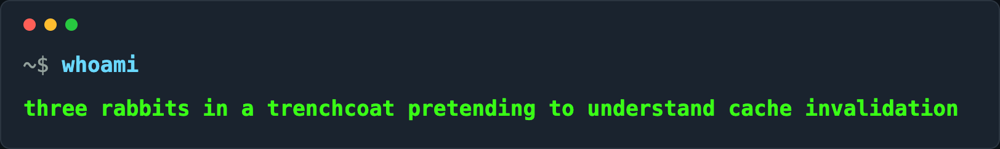

  
  
  <h1>Hi, I'm Adhi</h1>
  
  

    Building with 💚
  

  
   

  

I'm a software developer who enjoys building things that are both useful and thoughtful. I tend to gravitate toward work that mixes creativity with problem-solving, and I care a lot about writing code that's clean, clear, and actually helps someone.

## Projects

  
  
  
  
  

## Skills & Expertise

  <table>
    <tr>
      <td>
        <h3>Backend Development</h3>
         
        
      </td>
      <td>
        <h3>Frontend Development</h3>
         
        
      </td>
    </tr>
    <tr>
      <td>
        <h3>Databases</h3>
         
        
      </td>
      <td>
        <h3>Tools & Others</h3>
         
         
        
      </td>
    </tr>
  </table>

   

  

 